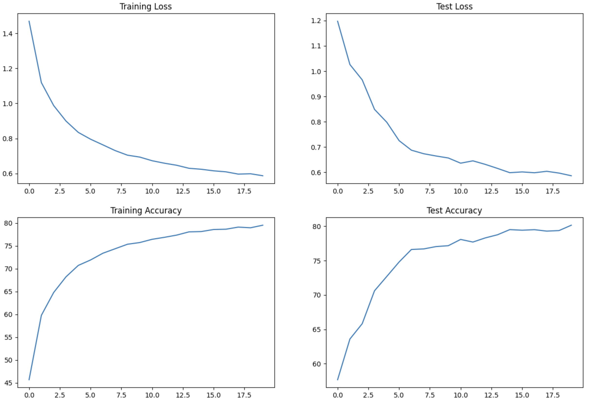
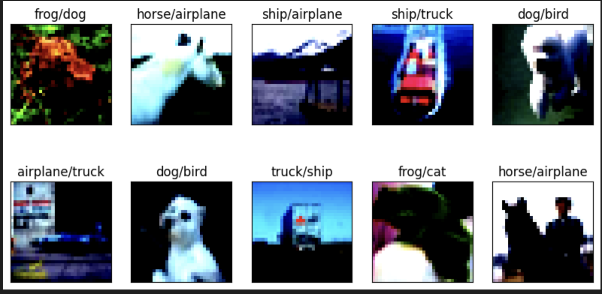

# Convolutional Neural Networks

## Usage
Collection of Convolutional Neural Networks are designed in this repo for training and the Models over Mnist and Cifar10 datasets.

You will find the model definations, Training and Testing methods inside the model.py file.

### model.py
You will find the model definations, Training and Testing methods inside the model.py file.

#### Summary
Let's see the summary of the model that can be used to train over Cifar10 dataset.
Below is the summary of the model.

----------------------------------------------------------------
        Layer (type)               Output Shape         Param #

================================================================

            Conv2d-1           [-1, 16, 32, 32]             448

              ReLU-2           [-1, 16, 32, 32]               0

       BatchNorm2d-3           [-1, 16, 32, 32]              32

           Dropout-4           [-1, 16, 32, 32]               0

            Conv2d-5           [-1, 32, 32, 32]           4,640

              ReLU-6           [-1, 32, 32, 32]               0

       BatchNorm2d-7           [-1, 32, 32, 32]              64

           Dropout-8           [-1, 32, 32, 32]               0

            Conv2d-9           [-1, 16, 32, 32]             528

        MaxPool2d-10           [-1, 16, 16, 16]               0

           Conv2d-11           [-1, 16, 16, 16]           2,320

             ReLU-12           [-1, 16, 16, 16]               0

      BatchNorm2d-13           [-1, 16, 16, 16]              32

          Dropout-14           [-1, 16, 16, 16]               0

           Conv2d-15           [-1, 32, 16, 16]           4,640

             ReLU-16           [-1, 32, 16, 16]               0

      BatchNorm2d-17           [-1, 32, 16, 16]              64

          Dropout-18           [-1, 32, 16, 16]               0

           Conv2d-19           [-1, 32, 16, 16]           9,248

             ReLU-20           [-1, 32, 16, 16]               0

      BatchNorm2d-21           [-1, 32, 16, 16]              64

          Dropout-22           [-1, 32, 16, 16]               0

          Conv2d-23           [-1, 16, 16, 16]             528

        MaxPool2d-24             [-1, 16, 8, 8]               0

           Conv2d-25             [-1, 32, 8, 8]           4,640

             ReLU-26             [-1, 32, 8, 8]               0

      BatchNorm2d-27             [-1, 32, 8, 8]              64

          Dropout-28             [-1, 32, 8, 8]               0

           Conv2d-29             [-1, 32, 6, 6]           9,248

             ReLU-30             [-1, 32, 6, 6]               0

      BatchNorm2d-31             [-1, 32, 6, 6]              64

          Dropout-32             [-1, 32, 6, 6]               0

           Conv2d-33             [-1, 32, 4, 4]           9,248

AdaptiveAvgPool2d-34             [-1, 32, 1, 1]               0

           Conv2d-35             [-1, 10, 1, 1]             330

Total params: 46,202
Trainable params: 46,202
Non-trainable params: 0
----------------------------------------------------------------
Input size (MB): 0.01
Forward/backward pass size (MB): 2.42
Params size (MB): 0.18
Estimated Total Size (MB): 2.61
----------------------------------------------------------------

----------------------------------------------------------------

***

### utils.py
In this file some reusable functions are defined that can be imported and used inside the project.

load_weights_from_path : This is the function to load the trained model
get_incorrrect_predictions : This function can be used to get incorrect prediction from the trained model over validation dataset.

***

### S8.ipynb
This is the notebook where dataset, dataset transformation and dataloaders are defined.
There are also the blocks of code present to visualise and understand the input images.
Finally model from model.py and functions from utils.py are imported in the notebook to train the model and test it's accuracy.

***
## Model Performance
Model performance for Cifar10 Model based on the model architecture mentioned above in summary are as follows:

### with Batch Normalization
Train Accuracy : 79.39

Test Accuracy : 80.93

### with Group Normalization
Train Accuracy : 78.99

Test Accuracy : 79.64

### with layer Normalization
Train Accuracy : 78.76

Test Accuracy : 79.88

## Graphs of Losses and accuracy of the Cifar10 model with Batch Normalization:

## Incorrect Predicton Examples

